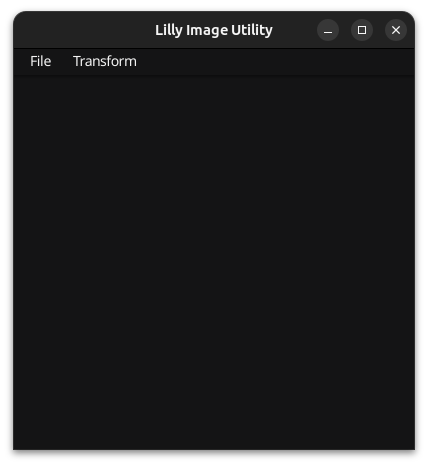
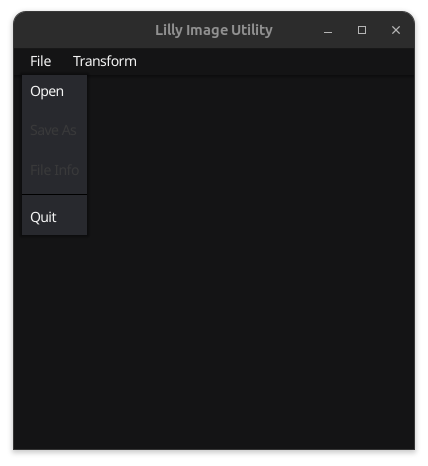
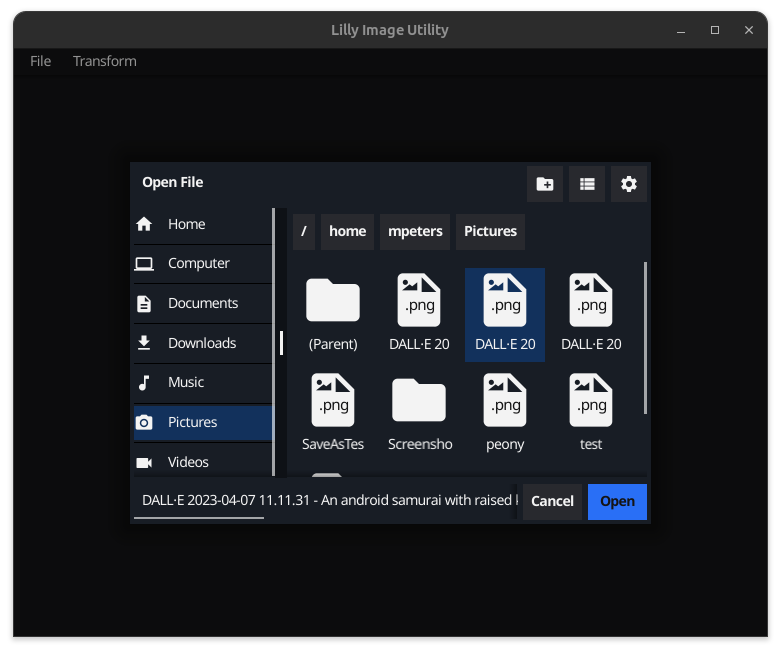
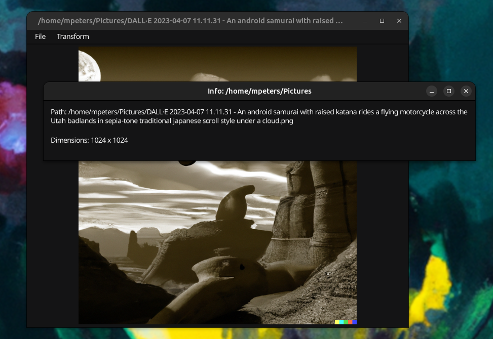
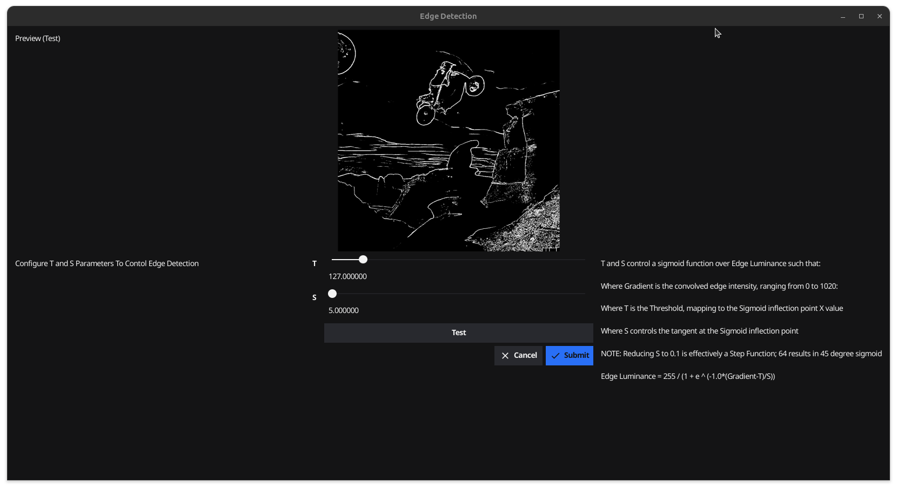

# Lilly #

## Summary ##

Lilly is an image manipulation application written in Go using the Fyne library.  It is licensed under the MIT license.

## Building Lilly ##

Lilly is written in Go and you should be able to build it anywhere.  The included Makefile and examples have been shown to work on Linux.

After you have cloned the project, change to the project directory and run `make`.  The lilly binary will be created in the `.build/` directory.

To build and run lilly in one command, use `make run`

The build directory is created and cleaned by the Makefile.

## Screenshots ##

### Initial Window ###

Upon starting, Lilly shows a default menu with the following options:

* File
* Transform

Only `File|Open` and `File|Quit` are enabled until a file is opened.

### File Selection ###

Select an image file and chose `Open` to load the image.

 The image will load and will by dynamically scaled to fit within the application window.  The underlying image is not reduced in scale.

### Image Information ###

You can see the file name and critical information by selecting `File|Info`

Once an image is loaded, the other menu options are enabled, including `File|Save As` which will save the loaded image to a new file.

## Transform ##

### Edge Detection ###

The `Transform | Edge Detection` dialog allows you to experiment with various settings to control the result of a Gaussian 3x3 convolution edge detection process.

Controls:

* F & S: Control a sigmoid to expand the differences between strong and weak edges.
* Luminance Threshold: Suppress / despeckle weaker edges from results.
* Test: Apply new settings against original image, preview results.
* Cancel: Exit without changing original image.
* Submit: Apply configured changes to original image.

